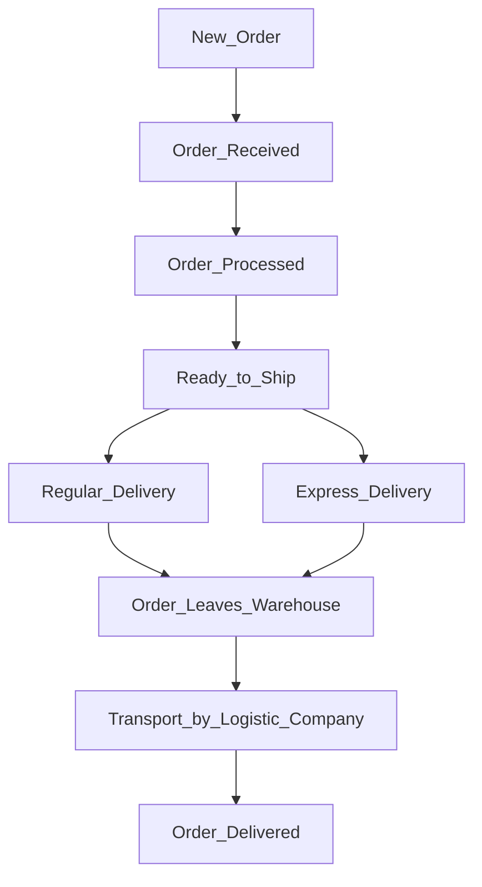

# Muesli-Sebastian-Deming

## Delivery process

### Order_Received_Day_1
Customers can send orders every day but the warehouse only works Monday to Friday so any orders received on the weekends wait until Monday to be actioned.

### Order_Processed_Day_2
* **Mo-Fr**
* Normally 2 days

### Order_Leaves_Warehouse_Day_3
* **Regular_Delivery**: Trucks Leave the warehouse on Mondays, Wednesdays and Fridays. Orders leave on trucks the day after they are made ready for shipping (or two days later if there is no truck).  --> **Mo, Mi, Fr**  
* **Express_Delivery**: Customers can pay for Express Processing that means the orders leave on the truck the day the order is ready for shipping.  

### Transport_by_Logistic_Company
* The logistics company has said they have on average 3 day delivery times to all locations. 
* They transport goods on weekends but only deliver to customers from their local distribution centers on weekdays.
